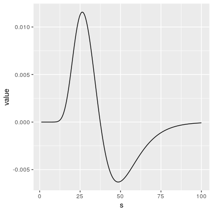
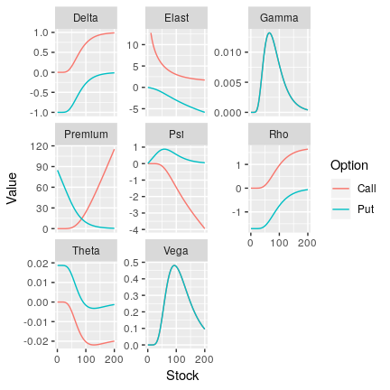
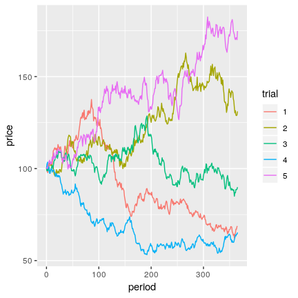
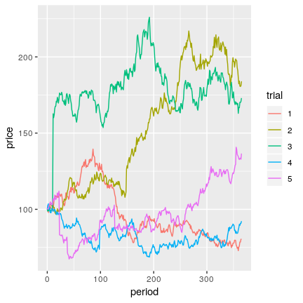
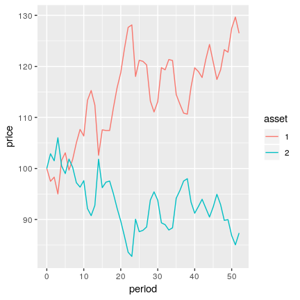
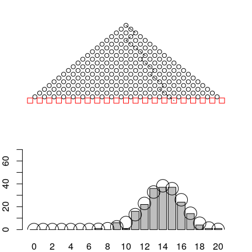
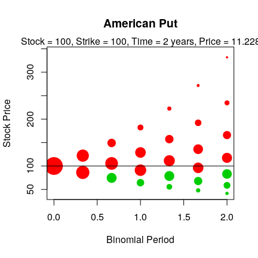
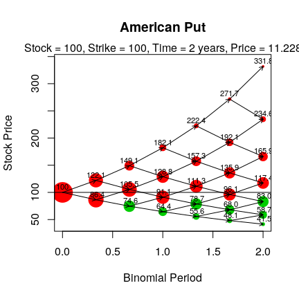
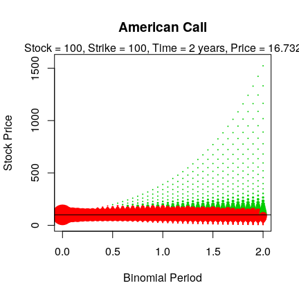
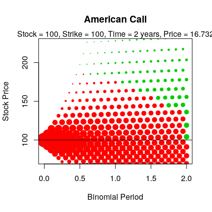

  - [Introduction](#introduction)
  - [Pricing functions and greeks](#pricing-functions-and-greeks)
      - [European Calls and Puts](#european-calls-and-puts)
      - [Barrier Options](#barrier-options)
      - [Perpetual American Options](#perpetual-american-options)
      - [Option Greeks](#option-greeks)
      - [Binomial Pricing of European and American
        Options](#binomial-pricing-of-european-and-american-options)
      - [Asian Options](#asian-options)
          - [Geometric Asian Options](#geometric-asian-options)
          - [Arithmetic Asian Options](#arithmetic-asian-options)
      - [Compound Options](#compound-options)
          - [Definition of a Compound
            Option](#definition-of-a-compound-option)
          - [Examples](#examples)
      - [Jumps and Stochastic
        Volatility](#jumps-and-stochastic-volatility)
      - [Bonds](#bonds)
  - [Monte Carlo simulation of
    prices](#monte-carlo-simulation-of-prices)
      - [Long vs wide output](#long-vs-wide-output)
      - [Simulated price paths](#simulated-price-paths)
      - [Multiple correlated stocks](#multiple-correlated-stocks)
          - [Negatively correlated
            assets](#negatively-correlated-assets)
          - [Three correlated assets](#three-correlated-assets)
  - [Functions with Graphical Output](#functions-with-graphical-output)
      - [Quincunx or Galton Board](#quincunx-or-galton-board)
      - [Plotting the Solution to the Binomial Pricing
        Model](#plotting-the-solution-to-the-binomial-pricing-model)
      - [References](#references)

# Introduction

This vignette is an overview to the functions in the *derivmkts*
package, which was conceived as a companion to my book *Derivatives
Markets* McDonald (2013). The material has an educational focus. There
are other option pricing packages for R, but this package has several
distinguishing features:

  - function names (mostly) correspond to those in .
  - vectorized Greek calculations are convenient both for individual
    options and for portfolios
  - the `simprice` function produces simulated asset prices
  - the `quincunx` function illustrates the workings of a quincunx
    (Galton board).
  - binomial functions include a plotting function that provides a
    visual depiction of early exercise

# Pricing functions and greeks

## European Calls and Puts

Table  lists the Black-Scholes related functions in the package.\[1\]
The functions `bscall`, `bsput`, and `bsopt` provide basic pricing of
European calls and puts. There are also options with binary payoffs:
cash-or-nothing and asset-or-nothing options. All of these functions are
vectorized. The function `bsopt` by default provides option greeks. Here
are some examples:

``` r
s <- 100; k <- 100; r <- 0.08; v <- 0.30; tt <- 2; d <- 0
bscall(s, k, v, r, tt, d)
[1] 24.02
bsput(s, c(95, 100, 105), v, r, tt, d)
[1]  7.488  9.239 11.188
```

## Barrier Options

There are pricing functions for the following barrier options:\[2\]

  - down-and-in and down-and-out barrier binary options
  - up-and-in and up-and-out barrier binary options
  - more standard down- and up- calls and puts, constructed using the
    barrier binary options

Naming for the barrier options generally follows the convention

    [u|d][i|o][call|put]

which means that the option is `up'' or`down’‘, `in'' or`out’’, and a
call or put.\[3\] An up-and-in call, for example, would be denoted by
`uicall`. For binary options, we add the underlying, which is either the
asset or $1: cash:

    [asset|cash][u|d][i|o][call|put]

``` r
H <- 115
bscall(s, c(80, 100, 120), v, r, tt, d)
[1] 35.28 24.02 15.88
## Up-and-in call
uicall(s, c(80, 100, 120), v, r, tt, d, H)
[1] 34.55 23.97 15.88
bsput(s, c(80, 100, 120), v, r, tt, d)
[1]  3.450  9.239 18.141
## Up-and-out put
uoput(s, c(80, 100, 120), v, r, tt, d, H)
[1] 2.328 5.390 9.070
```

## Perpetual American Options

The functions `callperpetual` and `putperetual` price infinitely-lived
American options.\[4\] The pricing formula assumes that all inputs
(risk-free rate, volatility, dividend yield) are fixed. This is of
course usual with the basic option pricing formulas, but it is more of a
conceptual stretch for an infinitely-lived option than for a 3-month
option.

In order for the option to have a determined value, the dividend yield
on the underlying asset must be positive if the option is a call. If
this is not true, the call is never exercised and the price is
undefined.\[5\] Similarly, the risk-free rate must be positive if the
option is a put.

By default, the perpetual pricing formulas return the price. By setting
`showbarrier=TRUE`, the function returns both the option price and the
stock price at which the option is optimally exercised (the
\`\`barrier’’). Here are some examples:

``` r
s <- 100; k <- 100; r <- 0.08; v <- 0.30; tt <- 2; d <- 0.04
callperpetual(s, c(95, 100, 105), v, r, d)
[1] 44.71 43.82 43.00
callperpetual(s, c(95, 100, 105), v, r, d, showbarrier=TRUE)
$price
[1] 44.71 43.82 43.00

$barrier
[1] 338.6 356.4 374.2
```

## Option Greeks

Options greeks are mathematical derivatives of the option price with
respect to inputs; see McDonald (2013), Chapters 12 and 13, for a
discussion of the greeks for vanilla options. Greeks for vanilla and
barrier options can be computed using the `greeks` function, which is a
wrapper for any pricing function that returns the option price and which
uses the default naming of inputs.^\[In this version of the package, I
have two alternative functions that return Greeks:

  - The `bsopt` function by default produces prices and Greeks for
    European calls and puts.
  - The `greeks2` function takes as arguments the name of the pricing
    function and then inputs as a list.

These may be deprecated in the future. `greeks2` is more cumbersome to
use but may be more robust. I welcome feedback on these functions and
what you find useful. \]

``` r
H <- 105
greeks(uicall(s, k, v, r, tt, d, H))
              uicall
Premium    18.719815
Delta       0.605436
Gamma       0.008011
Vega        0.480722
Rho         0.836133
Theta      -0.012408
Psi        -1.210530
Elasticity  3.234200
```

The value of this approach is that you can easily compute Greeks for
spreads and custom pricing functions. Here are two examples. First, the
value at time 0 of a prepaid contract that pays \(S_{T}^{a}\) at time
\(T\) is given by the `powercontract()` function:

``` r
powercontract <- function(s, v, r, tt, d, a) {
    price <- exp(-r*tt)*s^a* exp((a*(r-d) + 1/2*a*(a-1)*v^2)*tt)
}
```

We can easily compute the Greeks for a power contract:

``` r
greeks(powercontract(s=40, v=.08, r=0.08, tt=0.25, d=0, a=2))
           powercontract
Premium         1634.936
Delta             81.747
Gamma              2.044
Vega               0.654
Rho                4.087
Theta             -0.387
Psi               -8.175
Elasticity         2.000
```

Second, consider a bull spread in which we buy a call with a strike of
\(k_{1}\) and sell a call with a strike of \(k_2\). We can create a
function that computes the value of the spread, and then compute the
greeks for the spread by using this newly-created function together with
`greeks()`:

``` r
bullspread <- function(s, v, r, tt, d, k1, k2) {
    bscall(s, k1, v, r, tt, d) - bscall(s, k2, v, r, tt, d)
}
greeks(bullspread(39:41, .3, .08, 1, 0, k1=40, k2=45))
           bullspread_39 bullspread_40 bullspread_41
Premium        2.0020318     2.1551927     2.306e+00
Delta          0.1542148     0.1519426     1.487e-01
Gamma         -0.0017692    -0.0027545    -3.614e-03
Vega          -0.0080732    -0.0132218    -1.822e-02
Rho            0.0401235     0.0392251     3.793e-02
Theta         -0.0005476    -0.0003164    -8.246e-05
Psi           -0.0601438    -0.0607771    -6.099e-02
Elasticity     3.0041376     2.8200287     2.645e+00
```

The Greeks function is vectorized, so you can create vectors of greek
values with a single call. This example plots, for a bull spread, the
gamma as a function of the stock price; see Figure .

``` r
sseq <- seq(1, 100, by=0.5)
greeks(bullspread(sseq, .3, .08, 1, 0, k1=40, k2=45),
            initcaps = TRUE, long = TRUE) %>%
    filter(greek == 'Gamma' ) %>% 
    ggplot(aes(x = s, y = value)) + geom_line()
```



This code produces the plots in Figure :

``` r
k <- 100; r <- 0.08; v <- 0.30; tt <- 2; d <- 0
S <- seq(.5, 200, by=.5)
Call <- greeks(bscall(S, k, v, r, tt, d), long = TRUE)
Put <- greeks(bsput(S, k, v, r, tt, d), long = TRUE)
ggplot(rbind(Call, Put), aes(x = s, y = value, color = funcname )) +
    geom_line() + facet_wrap(~ greek, scales = 'free_y') +
    scale_color_discrete(name = 'Option', labels = c('Call','Put' )) +
    scale_x_continuous('Stock', breaks =c(0, 100, 200)  ) +
    scale_y_continuous('Value') 
```



## Binomial Pricing of European and American Options

There are two functions related to binomial option pricing:\[6\]

  - **binomopt** computes prices of American and European calls and
    puts. The function has three optional parameters that control
    output:
    
      - `returnparams=TRUE` will return as a vector the option pricing
        inputs, computed parameters, and risk-neutral probability.
    
      - `returngreeks=TRUE` will return as a vector the price, delta,
        gamma, and theta at the initial node.
    
      - `returntrees=TRUE` will return as a list the price, greeks, the
        full stock price tree, the exercise status (`TRUE` or `FALSE`)
        at each node, and the replicating portfolio at each node.

  - **binomplot** displays the asset price tree, the corresponding
    probability of being at each node, and whether or not the option is
    exercised at each node. This function is described in more detail in
    Section .

Here are examples of pricing, illustrating the default of just returning
the price, and the ability to return the price plus parameters, as well
as the price, the parameters, and various trees:

``` r
s <- 100; k <- 100; r <- 0.08; v <- 0.30; tt <- 2; d <- 0.03
binomopt(s, k, v, r, tt, d, nstep=3)
price 
 20.8 
binomopt(s, k, v, r, tt, d, nstep=3, returnparams=TRUE)
   price        s        k        v        r       tt        d    nstep 
 20.7961 100.0000 100.0000   0.3000   0.0800   2.0000   0.0300   3.0000 
       p       up       dn        h 
  0.4391   1.3209   0.8093   0.6667 
binomopt(s, k, v, r, tt, d, nstep=3, putopt=TRUE)
price 
12.94 
binomopt(s, k, v, r, tt, d, nstep=3, returntrees=TRUE, putopt=TRUE)
$price
price 
12.94 

$greeks
    delta     gamma     theta 
-0.335722  0.010614 -0.007599 

$params
       s        k        v        r       tt        d    nstep        p 
100.0000 100.0000   0.3000   0.0800   2.0000   0.0300   3.0000   0.4391 
      up       dn        h 
  1.3209   0.8093   0.6667 

$oppricetree
      [,1]   [,2]   [,3]  [,4]
[1,] 12.94  3.816  0.000  0.00
[2,]  0.00 21.338  7.176  0.00
[3,]  0.00  0.000 34.507 13.49
[4,]  0.00  0.000  0.000 47.00

$stree
     [,1]   [,2]   [,3]   [,4]
[1,]  100 132.09 174.47 230.45
[2,]    0  80.93 106.89 141.19
[3,]    0   0.00  65.49  86.51
[4,]    0   0.00   0.00  53.00

$probtree
     [,1]   [,2]   [,3]    [,4]
[1,]    1 0.4391 0.1928 0.08464
[2,]    0 0.5609 0.4926 0.32441
[3,]    0 0.0000 0.3146 0.41445
[4,]    0 0.0000 0.0000 0.17650

$exertree
      [,1]  [,2]  [,3]  [,4]
[1,] FALSE FALSE FALSE FALSE
[2,] FALSE FALSE FALSE FALSE
[3,] FALSE FALSE  TRUE  TRUE
[4,] FALSE FALSE FALSE  TRUE

$deltatree
        [,1]    [,2]    [,3]
[1,] -0.3357 -0.1041  0.0000
[2,]  0.0000 -0.6471 -0.2419
[3,]  0.0000  0.0000 -0.9802

$bondtree
      [,1]  [,2]  [,3]
[1,] 46.51 17.56  0.00
[2,]  0.00 73.71 33.03
[3,]  0.00  0.00 94.81
```

## Asian Options

There are analytical functions for valuing geometric Asian options and
Monte Carlo routines for valuing arithmetic Asian options.\[7\] Be aware
that the `greeks()` function at this time will not work with the Monte
Carlo valuation for arithmetic Asian options. I plan to address this in
a future release.\[8\]

### Geometric Asian Options

Geometric Asian options can be valued using the Black-Scholes formulas
for vanilla calls and puts, with modified inputs. The functions return
both call and put prices with a named vector:

``` r
s <- 100; k <- 100; r <- 0.08; v <- 0.30; tt <- 2; d <- 0.03; m <- 3
geomavgpricecall(s, 98:102, v, r, tt, d, m)
[1] 14.01 13.56 13.12 12.70 12.28
geomavgpricecall(s, 98:102, v, r, tt, d, m, cont=TRUE)
[1] 10.952 10.498 10.058  9.632  9.219
geomavgstrikecall(s, k, v, r, tt, d, m)
[1] 9.058
```

### Arithmetic Asian Options

Monte Carlo valuation is used to price arithmetic Asian options. For
efficiency, the function `arithasianmc` returns call and put prices for
average price and average strike options. By default the number of
simulations is 1000. Optionally the function returns the standard
deviation of each estimate

``` r
arithasianmc(s, k, v, r, tt, d, 3, numsim=5000, printsds=TRUE)
             Call    Put sd Call sd Put
Avg Price  14.323  8.216   22.12 11.690
Avg Strike  8.326  5.343   14.42  7.512
Vanilla    20.403 11.313   32.99 15.411
```

The function `arithavgpricecv` uses the control variate method to reduce
the variance in the simulation. At the moment this function prices only
calls, and returns both the price and the regression coefficient used in
the control variate correction:

``` r
arithavgpricecv(s, k, v, r, tt, d, 3, numsim=5000)
price  beta 
13.97  1.05 
```

## Compound Options

A compound option is an option where the underlying asset is an
option.\[9\] The terminology associated with compound options can be
confusing, so it may be easiest to start with an example.

Figure  is a timeline for a compound option that is an option to buy a
put. The compound option expires at \(t_{1}\) and the put expires at
\(t_{2}\). The owner of the compound option only acquires the put if at
time \(t_{1}\) it is worth at least \(k_{co}\), and only exercises the
put if at time \(t_{2}\) the stock price is less than \(k_{uo}\).

### Definition of a Compound Option

Based on the example, you can see that there are three prices associated
with a compound option:

  - The price of an underlying asset.
  - The price of the underlying option, which is an option to buy or
    sell the underlying asset (we will refer to this as the price of the
    underlying option)
  - The price of the compound option, which gives us the right to buy or
    sell the underlying option

The definition of a compound option therefore requires that we specify

  - whether the underlying option is a put or a call

  - whether the compound option is a put or a call

  - the strike price at which you can exercise the underlying option
    (\(k_{uo}\))

  - the strike price at which you can exercise the compound option
    (\(k_{co}\))

  - the date at which you can exercise the compound option (first
    exercise date, \(t_{1}\))

  - the date at which you can exercise the underlying option expires,
    \(t_{2}>t_{1}\).

Given these possibilities, you can have a call on a call, a put on a
call, a call on a put, and a put on a put. The valuation procedure
require calculating the underlying asset price at which you are
indifferent about acquiring the underlying option.

The price calculation requires computing the stock price above or below
which you would optimally exercise the option at time \(t_{1}\).

### Examples

As an example, consider the following inputs for a call option to buy a
call
option:

``` r
s <- 100; kuo <- 95; v <- 0.30; r <-  0.08; t1 <- 0.50; t2 <- 0.75; d <- 0
kco <- 3.50

calloncall(s, kuo, kco, v, r, t1, t2, d, returnscritical=TRUE)
    price scritical 
    13.12     88.68 
```

With these parameters, after 6 months (\(t_{1}=0.5\)), the compound
option buyer decides whether to pay $3.50 to acquire a 3-month call on
the underlying asset. (The volatility of the underlying asset is 0.3.)
It will be worthwhile to pay the compound strike, $3.50, as long as the
underlying asset price exceeds 88.68.

Similarly, there is a put on the call, and a call and put on the
corresponding put:

``` r
putoncall(s, kuo, kco, v, r, t1, t2, d, returnscritical=TRUE)
    price scritical 
   0.5492   88.6800 
callonput(s, kuo, kco, v, r, t1, t2, d, returnscritical=TRUE)
    price scritical 
    3.425    98.298 
putonput(s, kuo, kco, v, r, t1, t2, d, returnscritical=TRUE)
    price scritical 
    1.384    98.298 
```

## Jumps and Stochastic Volatility

The `mertonjump` function returns call and put prices for a stock that
can jump discretely.\[10\] A poisson process controls the occurrence of
a jump and the size of the jump is lognormally distributed. The
parameter `lambda` is the mean number of jumps per year, the parameter
`alphaj` is the log of the expected jump, and `sigmaj` is the standard
deviation of the log of the jump. The jump amount is thus drawn from the
distribution 

``` r
mertonjump(s, k, v, r, tt, d, lambda=0.5, alphaj=-0.2, vj=0.3)
   Call   Put
1 28.15 13.37
c(bscall(s, k, v, r, tt, d), bsput(s, k, v, r, tt, d))
[1] 24.025  9.239
```

## Bonds

The simple bond functions provided in this version compute the present
value of cash flows (`bondpv`), the IRR of the bond (`bondyield`),
Macaulay duration (`duration`), and convexity (`convexity`).

``` r
coupon <- 8; mat <- 20; yield <- 0.06; principal <- 100; 
modified <- FALSE; freq <- 2
price <- bondpv(coupon, mat, yield, principal, freq)
price
[1] 123.1
bondyield(price, coupon, mat, principal, freq)
[1] 0.06
duration(price, coupon, mat, principal, freq, modified)
[1] 11.23
convexity(price, coupon, mat, principal, freq)
[1] 170.3
```

# Monte Carlo simulation of prices

The function `simprice` provides a flexible way to generate prices that
can be used for Monte Carlo valuation or just to illustrate sample
paths.\[11\] This function implements “naive” Monte Carlo, not using any
variance reduction techniques. When supplied with a covariance matrix,
`simprice` produces simulations of multiple assets with correlated
returns. There are default values for all inputs.

Other option pricing functions in this package assume that you specify
volatility as the annualized return standard deviation. With a scalar
volatility input, the `simprice` function also interprets the value as a
standard deviation. A matrix, however, is interpreted as a covariance
matrix, which means that the individual stock volatilities are square
root of the diagonal elements. Because scalar and matrix inputs are
treated differently, there is an option To change the behavior for a
scalar input. To interpret the value as a variance, specify
`scalar_v_is_stddev = FALSE`.

## Long vs wide output

The function `simprice` can produce either long or wide output. Here are
examples of each, using the default parameters.\[12\]

``` r
args(simprice)
function (s0 = 100, v = 0.3, r = 0.08, tt = 1, d = 0, trials = 2, 
    periods = 3, jump = FALSE, lambda = 0, alphaj = 0, vj = 0, 
    seed = NULL, long = TRUE, scalar_v_is_stddev = TRUE) 
NULL
simprice(long = TRUE)
      asset trial period numjumps price
1.1.1     1     1      0        0 100.0
1.1.2     1     1      1        0 120.4
1.1.3     1     1      2        0 154.8
1.1.4     1     1      3        0 155.5
1.2.1     1     2      0        0 100.0
1.2.2     1     2      1        0 102.9
1.2.3     1     2      2        0 128.6
1.2.4     1     2      3        0 118.0
simprice(long = FALSE)
  asset  h0    h1    h2    h3
1     1 100 120.4 154.8 155.5
2     1 100 102.9 128.6 118.0
```

## Simulated price paths

A simple example is to generate 5 random sample paths of daily stock
prices for a year; see Figure :

``` r
s0 <- 100; v <- 0.3; r <- 0.10; d <- 0; tt <- 1
trials <- 5; periods <- 365; set.seed(1)
s <- simprice(s0 = s0, v = v, r = r, tt = tt, d = d, trials = trials,
              periods = periods, jump = FALSE, long = TRUE)
ggplot(s, aes(x = period, y = price, color = trial, group = trial)) +
    geom_line()
```



We can do the same exercise adding jumps; see Figure .

``` r
s0 <- 100; v <- 0.3; r <- 0.10; d <- 0; tt <- 1
trials <- 5; periods <- 365; jump <- TRUE; lambda <- 2;
alphaj <- -0.1; vj <- 0.2; set.seed(1)
s <- simprice(s0 = s0, v = v, r = r, tt = tt, d = d, trials = trials,
              periods = periods, jump = jump, alphaj = alphaj,
              lambda = lambda, vj = vj, long = TRUE)
ggplot(s, aes(x = period, y = price, color = trial, group = trial)) +
    geom_line()
```



## Multiple correlated stocks

When you supply an \(n\times n\) covariance matrix as the volatility
input, `simprice` produces simulations for \(n\) stocks using the
specified covariances. This makes it convenient to use an esimated
covariance matrix to produce a simulation.

### Negatively correlated assets

To illustrate the use of a covariance matrix, Figure  plots two stocks
which are highly negatively correlated.

``` r
set.seed(1)
s0 <- 100; r <- 0.08; tt <- 1;  d <- 0; jump <- FALSE
trials <- 1; periods <- 52;
v <- .3^2*matrix(c(1, -.99, -.99, 1), nrow = 2)
s <- simprice(s0 = s0, v = v, r = r, tt = tt, d = d, trials = trials,
              periods = periods, jump = jump, long = TRUE)
ggplot(s, aes(x = period, y = price, group = asset, color = asset)) +
    geom_line()
```



### Three correlated assets

Here is an example using a three-asset covariance matrix, showing that
the simulated series have the correct variance structure. We have three
correlated stocks with standard deviations of 60%, 20%, and 45%., with
the covariance matrix given by `v`. We can compare the estimated
covariance matrix with the input,`v`:

``` r
set.seed(1)
tt <- 2; periods <- tt*365

vc <- vols <- diag(3)
diag(vols) <- c(.6, .2, .45)   ## volatilities
corrs <- c(.4, -.3, .25)
vc[lower.tri(vc)] <- corrs  ## correlations
vc <- t(vc) ## lower triangular becomes upper triangular
vc[lower.tri(vc)] <- corrs
v <- vols %*% vc %*% vols
v
       [,1]   [,2]    [,3]
[1,]  0.360 0.0480 -0.0810
[2,]  0.048 0.0400  0.0225
[3,] -0.081 0.0225  0.2025

s <- simprice(s0 = s0, v = v, r = r, tt = tt, d = d, trials = 1,
              periods = periods, jump = FALSE, long = TRUE)

threestocks <- s %>%
    filter(trial == 1) %>%
    group_by(asset) %>%
    mutate(ret = log(price/lag(price)),
           row = row_number()) %>%
    select(asset, period, ret) %>%
    spread(key = asset, value = ret )

var(threestocks[2:4], na.rm = TRUE)*365
         1       2        3
1  0.37637 0.04590 -0.07944
2  0.04590 0.04163  0.02933
3 -0.07944 0.02933  0.23029
```

# Functions with Graphical Output

Several functions provide visual illustrations of some aspects of the
material.

## Quincunx or Galton Board

The quincunx is a physical device the illustrates the central limit
theorem. A ball rolls down a pegboard and strikes a peg, falling
randomly either to the left or right. As it continues down the board it
continues to strike a series of pegs, randomly falling left or right at
each. The balls collect in bins and create an approximate normal
distribution.

The quincunx function allows the user to simulate a quincunx, observing
the path of each ball and watching the height of each bin as the balls
accumulate. More interestingly, the quincunx function permits altering
the probability that the ball will fall to the right.

Figure  illustrates the function after dropping 200 balls down 20 levels
of pegs with a 70% probability that each ball will fall right:

``` r
par(mar=c(2,2,2,2))
quincunx(n=20, numballs=200, delay=0, probright=0.7)
```



## Plotting the Solution to the Binomial Pricing Model

The `binomplot` function calls `binomopt` to compute the option price
and the various trees, which it then uses in plotting:

The first plot, figure , is basic:

``` r
s0 <- 100; k <- 100; v <- 0.3; r <- 0.08; tt <- 2; d <- 0
binomplot(s0, k, v, r, tt, d, nstep=6, american=TRUE, putopt=TRUE)
```



The second plot, figure , adds a display of stock prices and arrows
connecting the nodes.

``` r
binomplot(s0, k, v, r, tt, d, nstep=6, american=TRUE, putopt=TRUE,
    plotvalues=TRUE, plotarrows=TRUE)
```



As a final example, consider an American call when the dividend yield is
positive and `nstep` has a larger value. Figure  shows the plot, with
early exercise evident.

``` r
d <- 0.06
binomplot(s0, k, v, r, tt, d, nstep=40, american=TRUE)
```



The large value of `nstep` creates a high maximum terminal stock price,
which makes details hard to discern in the boundary region where
exercise first occurrs. We can zoom in on that region by selecting
values for `ylimval`; the result is in Figure .

``` r
d <- 0.06
binomplot(s0, k, v, r, tt, d, nstep=40, american=TRUE, ylimval=c(75, 225))
```



## References

<div id="refs" class="references">

<div id="ref-black/scholes:73">

Black, Fischer, and Myron Scholes. 1973. “The Pricing of Options and
Corporate Liabilities.” *Journal of Political Economy* 81: 637–59.

</div>

<div id="ref-cox/ross/rubinstein:79">

Cox, John C., Stephen A. Ross, and Mark Rubinstein. 1979. “Option
Pricing: A Simplified Approach.” *Journal of Financial Economics* 7 (3):
229–63.

</div>

<div id="ref-geske:79">

Geske, Robert. 1979. “The Valuation of Compound Options.” *Journal of
Financial Economics* 7: 63–81.

</div>

<div id="ref-glasserman:mc:04">

Glasserman, Paul. 2004. *Monte Carlo Methods in Financial Engineering*.
Applications of Mathematics 53. New York: Springer-Verlag.

</div>

<div id="ref-kemna/vorst:90">

Kemna, A. G. Z., and A. C. F. Vorst. 1990. “A Pricing Method for Options
Based on Average Asset Values.” *Journal of Banking and Finance* 14:
113–29.

</div>

<div id="ref-mcdonald:derivs:13">

McDonald, Robert L. 2013. *Derivatives Markets*. 3rd ed. Boston, MA:
Pearson/Addison Wesley.

</div>

<div id="ref-merton:73-bell">

Merton, Robert C. 1973. “Theory of Rational Option Pricing.” *Bell
Journal of Economics and Management Science* 4 (1): 141–83.

</div>

<div id="ref-merton/jfe/1976">

———. 1976. “Option Pricing When Underlying Stock Returns Are
Discontinuous.” *Journal of Financial Economics* 3 (1): 125–44.

</div>

<div id="ref-rendleman/bartter:79-jf">

Rendleman, Richard J., Jr., and Brit J. Bartter. 1979. “Two-State Option
Pricing.” *Journal of Finance* 34 (5): 1093–1110.

</div>

</div>

1.  See Black and Scholes (1973) and Merton (1973).

2.  See Merton (1973), p. 175, for the first derivation of a barrier
    option pricing formula and McDonald (2013), Chapter 14, for an
    overview.

3.  This naming convention differs from that in McDonald (2013), in
    which names are `callupin`, `callupout`, etc. Thus, I have made both
    names available for these functions.

4.  Merton (1973) derived the price of a perpetual American put.

5.  A well-known result (see Merton (1973)) is that a standard American
    call is never exercised before expiration if the dividend yield is
    zero and the interest rate is non-negative. A perpetual call with
    \(\delta=0\) and \(r>0\) would thus never be exercised. The limit of
    the option price as \(\delta\to 0\) is \(s\), so in this case the
    function returns the stock price as the option value.

6.  See Cox, Ross, and Rubinstein (1979), Rendleman and Bartter (1979),
    and McDonald (2013), Chapter 11

7.  See Kemna and Vorst (1990).

8.  As the functions are currently written, each invocation of the
    pricing function will start with a different random number seed,
    resulting in price variation that is due solely to random variation.
    Moreover, random number generation changes the random number seed
    globally. In a future release I hope to address this by saving and
    restoring the seed within the greeks function. For the curious, [a
    Stackoverflow
    post](http://stackoverflow.com/questions/14324096/setting-seed-locally-not-globally-in-r)
    discusses this issue.

9.  See Geske (1979) and McDonald (2013), Chapter 14.

10. See Merton (1976).

11. For more information on Monte Carlo see McDonald (2013), Chapter 19,
    and Glasserman (2004), especially Chapter 4.

12. The `simprice` function save and restores the random number seed, so
    repeated invocations without intermediate seed-changing actions will
    produce the same result.
